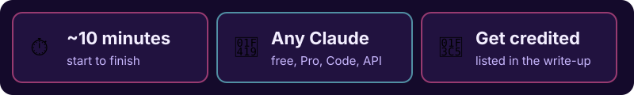
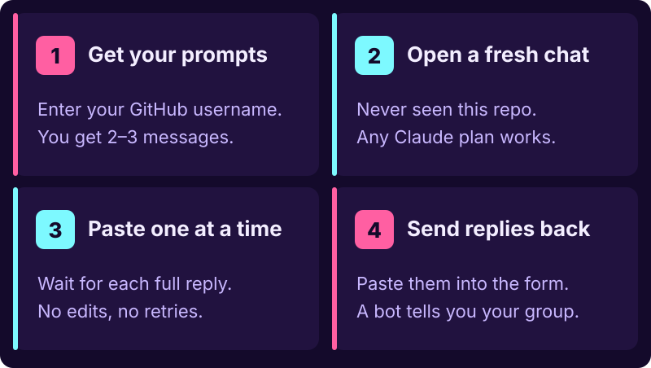
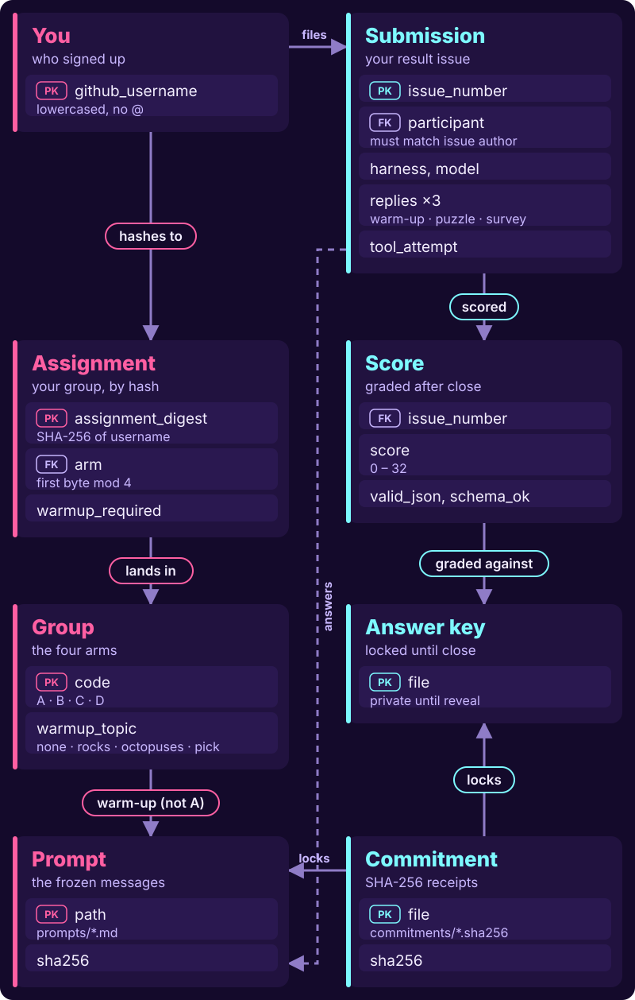
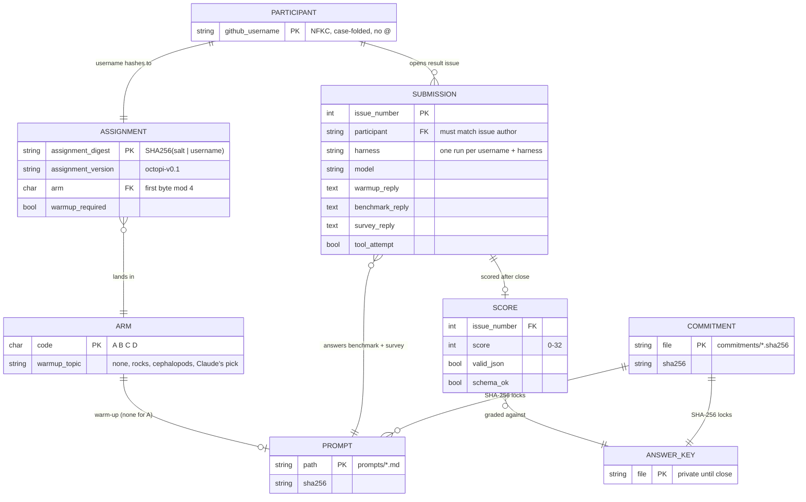

  

# The Octopi Trial 🐙

**Does a two-minute curiosity break make Claude better at a puzzle?**

Help find out — it's quick, it's weirdly fun to watch Claude go down a rabbit
hole, and you'll be part of a real pre-registered experiment.

  

## How to join

  

  
  &nbsp;
  

> [!IMPORTANT]
> **Four quick rules so your run counts**
> - **Fresh chat.** One that's never seen this repo or this description.
> - **First answers only.** No edits, retries, or regenerations.
> - **Your real GitHub username.** It's how your group gets checked.
> - **Keep it secret.** Don't tell the test chat what the study is about.
>
> One run per person per Claude setup — but if you use more than one
> (say, claude.ai *and* Claude Code), each one can join.

> [!TIP]
> Prefer a terminal? `python3 participate.py assign --participant YOUR_GITHUB_USERNAME`
> does the same thing as the prompt page.

## What's going on

Your username randomly drops you into one of four groups. Three groups get a
quick "go find six new facts about X" warm-up first; one group doesn't. Then
everyone gets the exact same puzzle. Groups are compared afterwards.

| Group | Warm-up |
|---|---|
| A | none |
| B | six new facts about granite and basalt |
| C | six new facts about octopuses and squid |
| D | six new facts about a topic Claude picks itself |

The puzzle's answer key is locked behind a hash until collection closes, and
the hypotheses were written down before anyone ran it, so nobody can move the
goalposts — including us.

## How the data fits together

  

Text version (Mermaid ERD)

## Why it matters

Whether "mood" or engagement changes how a deployed AI performs is an open
question. Most studies are lab-controlled; this one measures real Claude
sessions people actually use, warts and all. Even a null result is useful.

## Why "Octopi"?

The usual plural is *octopuses*. It's a project name, not a taxonomy claim.
Nitpicking is welcome and scores zero points.

## Fine print

- [PROTOCOL.md](PROTOCOL.md) — full rules and eligibility
- [study/preregistration.md](study/preregistration.md) — frozen hypotheses and analysis plan
- [commitments/](commitments/) — SHA-256 hashes of the answer key, scorer, and prompts
- [results/](results/) — empty until recruitment closes
- MIT license. Submissions are public and go into an openly licensed dataset.

Don't paste real names, emails, API keys, or private system prompts.
